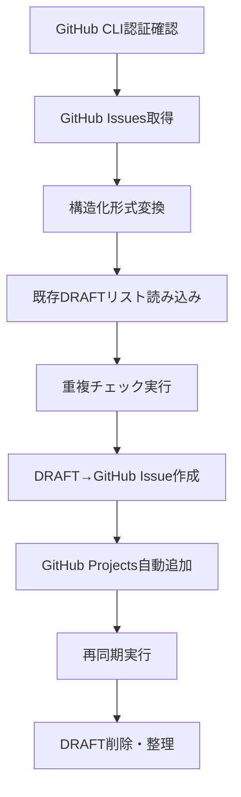
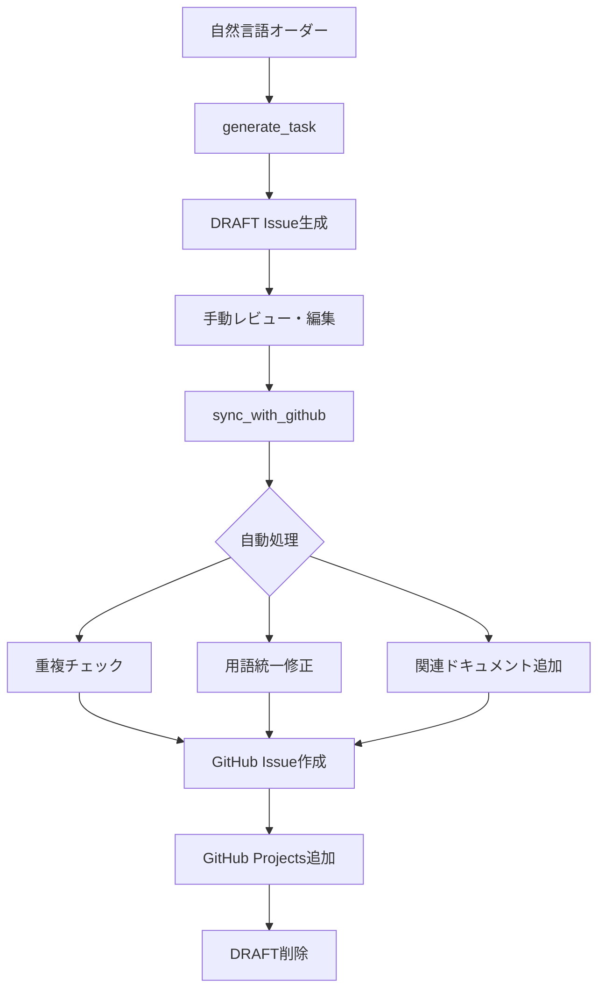

# MCP Server 技術仕様書

汎用的なModel Context Protocol サーバーの包括的な技術仕様書

## 📋 システム概要

### 目的と位置づけ
- **主目的**: プロジェクトでのAIエージェント（Cursor、Windsurf、Claude Code等）利用時に、プロジェクトルール、ドキュメント、Issue管理機能を提供
- **技術基盤**: TypeScript + Deno runtime + Model Context Protocol (MCP)
- **汎用性**: `.mcp.json`設定により任意のプロジェクトで利用可能
- **プロジェクト内の役割**: AIエージェントとプロジェクトリソースを橋渡しする統合基盤

### システム責任範囲
- Issue管理の完全自動化（構造化フィールド形式対応）
- GitHub同期とGitHub Projects連携
- AI支援Issue生成システム
- 動的ドキュメント探索とプロジェクトコンテキスト収集
- 用語統一と関連ドキュメント提案
- エントリーポイントベースの設定管理

## 🏗️ アーキテクチャ設計

### 全体構成
```
MCP Server (stdio)
├── Tools Layer         - ユーザー向け操作機能
├── Resources Layer     - 文書・データアクセス
├── Handler Layer       - ビジネスロジック
├── Utils Layer         - 共通ユーティリティ
└── Types Layer         - 型定義・スキーマ
```

### コンポーネント構成
```
tools/mcp-server/
├── src/
│   ├── server.ts                    # MCP Server エントリーポイント
│   ├── types/                       # 型定義とスキーマ
│   │   ├── issue.ts                 # Issue関連型（構造化形式）
│   │   ├── constants.ts             # プロジェクト定数
│   │   └── mcp.ts                   # MCP仕様準拠型
│   ├── handlers/                    # ツールハンドラー
│   │   ├── github-sync.ts           # GitHub双方向同期
│   │   ├── terminology-checker.ts   # 用語統一チェック
│   │   ├── intelligent-issue-analyzer.ts  # AI Issue分析（内部モジュール）
│   │   ├── intelligent-issue-generator.ts # AI Issue生成
│   │   ├── github-projects.ts       # GitHub Projects管理
│   │   ├── document-search.ts       # ドキュメント検索・読み取り
│   │   └── memory-manager.ts        # 学習記録ファイル管理
│   ├── resources/                   # リソースプロバイダー
│   │   ├── docs-provider.ts         # _llm-docs/ 管理
│   │   ├── rules-provider.ts        # _llm-rules/ 管理
│   │   ├── issues-provider.ts       # Issue統計・状態管理
│   │   └── terminology-provider.ts  # 用語辞書管理
│   ├── utils/                       # 共通ユーティリティ
│   │   ├── project-config-loader.ts # .mcp.json設定読み込み
│   │   ├── document-explorer.ts     # ドキュメント探索・解析
│   │   ├── project-context.ts       # プロジェクトコンテキスト収集
│   │   ├── github-client.ts         # GitHub API操作
│   │   ├── issue-file-manager.ts    # ローカルIssue管理
│   │   ├── github-projects.ts       # GitHub Projects API
│   │   ├── idempotency-manager.ts   # 冪等性保証
│   │   ├── path-resolver.ts         # パス解決
│   │   └── file-operations.ts       # ファイル操作ユーティリティ
│   └── data-validation.ts           # 内部検証用モジュール（手動実行不可）
├── dev/                             # 開発・デバッグ用ツール
│   ├── test-mcp-client.ts           # MCPクライアントテスト
│   ├── test-github-projects.ts      # GitHub Projectsテスト
│   └── README.md                    # 開発ツール説明
├── package.json
└── deno.json
```

## 🛠️ ツール仕様

### Core Tools

#### sync_with_github
**機能**: GitHub⇄ローカルの双方向同期

```typescript
interface SyncParams {
  repo: string;              // 対象リポジトリ（.mcp.json設定で定義されたリポジトリキー）
  include_closed: boolean;   // クローズド Issue 含む（デフォルト: true）
}
```

**処理フロー**:


#### check_terminology
**機能**: プロジェクト用語統一チェック・置換提案（内部ツール）

```typescript
interface TerminologyParams {
  text: string;                    // チェック対象テキスト
  suggest_replacements: boolean;   // 置換提案表示（デフォルト: true）
  check_consistency: boolean;      // 一貫性チェック実行（デフォルト: true）
}
```

**機能詳細**:
- 設定で指定された辞書ファイル（documents.dictionary）をベースとした用語統一
- 日本語⇔英語の双方向マッピング
- カテゴリ別用語分類とコンテキスト提案
- **注意**: 内部ツールのため直接呼び出し不可、他のツールから自動実行

#### generate_task
**機能**: 明示的コマンド実行時のみ動作。自然言語からタスク分解とIssue候補生成

```typescript
interface GenerateParams {
  order: string;              // 自然言語での要求仕様
  target_repo: string;        // 対象リポジトリ（.mcp.json設定で定義されたリポジトリキー）
  context?: string;           // 追加コンテキスト
  force_regenerate: boolean;  // キャッシュ無視（デフォルト: false）
  save_to_draft: boolean;     // DRAFT自動保存（デフォルト: false）
}
```

**4段階解析プロセス**:


**AI支援Issue本文生成**:
- LLMが収集情報を基に動的思考・生成
- **生成プロセス**:
  1. エントリーポイント（requirements_definition.md）から関連ドキュメント探索
  2. リポジトリタイプに応じた技術仕様書の自動選択
  3. 実装原則（implementation_principles.md）とコアルール（core_rules.md）の適用
  4. タスクの性質に応じた最適なIssue本文の生成

#### save_draft_issues
**機能**: Issue候補をDRAFTセクションに構造化形式で保存

```typescript
interface SaveDraftParams {
  repo: string;  // .mcp.json設定で定義されたリポジトリキー
  issues: Array<{
    title: string;
    body?: string;
    labels?: string;
    category?: ProjectsCategory;   // structure/frontend/backend/infrastructure
    priority?: ProjectsPriority;   // Critical/High/Medium/Low
    section?: string;              // 任意の文字列（パススルー値）
  }>;
}
```

#### manage_github_projects
**機能**: GitHub Projects連携管理

```typescript
interface ProjectsParams {
  action: "add_issue" | "check_access" | "list_config";
  issue_url?: string;    // Issue URL（add_issue時必須）
  repo?: string;         // リポジトリキー（.mcp.json設定で定義、add_issue時必須）
  labels?: string;       // ラベル（カンマ区切り、パススルー値）
}
```

#### search_documents
**機能**: プロジェクトドキュメント検索

```typescript
interface SearchParams {
  query: string;                   // 検索クエリ（テキストまたは正規表現）
  directories?: string[];          // 検索対象ディレクトリ（_llm-rules, _llm-memories, _llm-docs）
  useRegex?: boolean;              // 正規表現モード（デフォルト: false）
  maxResults?: number;             // 最大表示ファイル数（デフォルト: 10）
  includeContext?: boolean;        // 前後文脈を含める（デフォルト: true）
  contextLines?: number;           // 表示する前後の行数（デフォルト: 3）
}
```

**検索機能**:
- キーワード検索と正規表現検索の両対応
- 複数ディレクトリの横断検索
- マッチ箇所の前後文脈表示
- 検索結果の制限とページング

#### read_document
**機能**: ドキュメント読み取り

```typescript
interface ReadParams {
  path: string;           // 読み取るファイルのパス
  startLine?: number;     // 開始行番号（省略時は1行目から）
  endLine?: number;       // 終了行番号（省略時は最後まで）
}
```

**アクセス制御**:
- 許可されたディレクトリのみアクセス可能（_llm-rules, _llm-memories, _llm-docs）
- ファイル情報（最終更新日、サイズ）の表示
- 部分読み取りによる大容量ファイル対応

#### manage_memory
**機能**: 学習記録ファイルの管理（時系列ソート、状態確認、統計分析）

```typescript
interface MemoryManagerParams {
  action: "sort" | "check" | "sync" | "analyze";  // 実行するアクション
}
```

**アクション詳細**:
- `sort`: 学習記録ファイル（learned.md, prompts.md, right-from-the-start.md）を日時の新しい順にソート
- `check`: 各ファイルの行数、最新日時、ソート状態を確認
- `sync`: sync_with_github実行後の推奨アクション（状態確認→ソート実行）
- `analyze`: 学習記録の統計分析（エントリー数、活動傾向、月別平均）

**処理対象**:
- `_llm-memories/learned.md`: 学習内容の記録
- `_llm-memories/prompts.md`: プロンプト履歴
- `_llm-memories/right-from-the-start.md`: 初手判断記録


## 📚 リソース仕様

### リソースプロバイダー構成

#### docs-provider（_llm-docs/）
**提供リソース**:
```
file://_llm-docs/requirements_definition.md  # プロジェクト要件定義
file://_llm-docs/github-projects-config.md   # GitHub Projects設定
file://_llm-docs/dictionary.md               # 用語辞書
file://_llm-docs/*/                          # 各種仕様書
```

**AI機能**:
- 関連ドキュメント自動推薦
- キーワードベース横断検索
- 用語統一チェック

#### rules-provider（_llm-rules/）
**提供リソース**:
```
file://_llm-rules/session_control.md         # セッション制御基点
file://_llm-rules/core_rules.md              # 基本ルール
file://_llm-rules/*/                         # 専門ルール群
```

#### issues-provider（_llm-memories/issues/）
**動的リソース**:
```
file://_llm-memories/issues/{repo-key}.md    # 各リポジトリのIssue（.mcp.json設定に基づく）
file://_llm-memories/issues/summary          # 統計サマリー（動的生成）
```

**ファイル名**: 設定で定義されたリポジトリキーに基づいて動的に決定

#### terminology-provider（用語辞書）
**プロトコルリソース**:
```
terminology://dictionary/full                # 完全辞書（JSON）
terminology://dictionary/japanese-to-english # 日⇒英マッピング
terminology://dictionary/categories          # カテゴリ分類
```

### リソースメタデータ構造
```typescript
interface McpResource {
  uri: string;           // 一意識別子
  name: string;          // 表示名
  description: string;   # 説明文
  mimeType?: string;     // "text/markdown" | "application/json"
}
```

## 🔄 データフロー仕様

### Issue管理ワークフロー


### 構造化Issue形式
```
- #番号 | タイトル | label | category | priority | section | 状態
```

**フィールド仕様**:
- **番号**: GitHub Issue番号（DRAFT時は"NEW"）
- **タイトル**: Issue概要
- **label**: GitHub ラベル（任意の文字列、パススルー値）
- **category**: 技術領域（structure/frontend/backend/infrastructure）
- **priority**: 優先度（Critical/High/Medium/Low）
- **section**: 任意の文字列（パススルー値、プロジェクト固有の値）
- **状態**: DRAFT/OPEN/CLOSED

### GitHub Projects連携仕様
**フィールドマッピング**:
```json
{
  "処理方針": {
    "label": "パススルー値として直接設定（解析・変換なし）",
    "section": "パススルー値として直接設定（解析・変換なし）",
    "category": "DRAFTで指定された値をそのまま使用",
    "priority": "DRAFTで指定された値をそのまま使用"
  },
  "設定ベース処理": {
    "github.projectNumber": ".mcp.json設定から取得",
    "repositories": ".mcp.json設定からリポジトリマッピング取得"
  }
}
```

**処理方針**:
- ラベルとセクションは解析・変換を行わず、DRAFT値をそのまま使用
- 設定ベース処理：すべての設定は`.mcp.json`から動的取得
- プロジェクト汎用性：固定マッピングに依存しない柔軟な設計

## 🔧 API仕様

### MCP準拠インターフェイス
```typescript
// 統一レスポンス形式
interface McpResponse {
  content: Array<{
    type: "text";
    text: string;      // 結果テキスト（Markdown形式）
  }>;
}

// エラーレスポンス
interface McpError {
  code: number;        // MCPエラーコード
  message: string;     // エラーメッセージ
  data?: any;         // 詳細情報
}
```

### エラーハンドリング方針
1. **統一形式**: 全ツールで一貫したエラーレスポンス
2. **詳細情報**: スタックトレース、原因分析含む
3. **解決手順**: 具体的な修正アクション提示
4. **ユーザーフレンドリー**: 技術的詳細の適切な抽象化

## 🚀 拡張性設計

### プラグイン式アーキテクチャ
- **新ツール追加**: `handlers/`にハンドラー追加、`server.ts`で登録
- **リソースプロバイダー追加**: `resources/`に新プロバイダー追加
- **型安全性**: Zodスキーマによる実行時バリデーション

### 汎用化アーキテクチャ
- **完全設定駆動**: ハードコーディング完全排除
- **動的ドキュメント探索**: エントリーポイントからの自動探索
- **プロジェクト独立**: 任意のファイル構造・言語に対応
- **AI支援生成**: 定型文に依存しない知的なコンテンツ生成

### 設定外部化
```typescript
// project-config-loader.ts
interface ProjectConfig {
  github: {
    ownerType: "organization" | "user";
    ownerName: string;
    projectNumber: number;
  };
  repositories: Record<string, string>;
  documentRepository?: string;
  documents?: {
    entryPoint?: string;
    dictionary?: string;
    implementationPrinciples?: string;
    coreRules?: string;
  };
}
```

**設定ベース処理**:
- すべてのパスと設定が`.mcp.json`で管理
- プロジェクト固有のハードコーディング完全排除
- 任意のプロジェクト構造に対応

### キャッシュ戦略
- **AIIssue生成**: 冪等性管理による結果キャッシュ
- **用語辞書**: インメモリキャッシュ
- **文書検索**: TF-IDFベクトルのキャッシュ

## 📊 パフォーマンス仕様

### 処理性能目標
- **Issue同期**: 100件のIssue処理 < 30秒
- **重複チェック**: 1000件との比較 < 5秒
- **用語チェック**: 10KB文書の解析 < 2秒
- **Issue生成**: 複雑な要求の解析 < 15秒

### 同時実行制御
```typescript
const PERFORMANCE_CONFIG = {
  max_concurrent_operations: 5,
  batch: {
    max_batch_size: 20,
    timeout_seconds: 120
  },
  cache: {
    ttl_minutes: 15,
    max_size: 100
  }
};
```

## 🔒 セキュリティ仕様

### 権限管理
```typescript
// Deno権限（--allow-* フラグ）
const REQUIRED_PERMISSIONS = {
  "--allow-read": "_llm-docs,_llm-rules,_llm-memories",
  "--allow-write": "_llm-memories",  
  "--allow-net": "api.github.com",
  "--allow-run": "gh",
  "--allow-env": true,
  "--allow-sys": "homedir"
};
```

### データ保護
- **機密情報**: GitHub認証情報は環境変数経由
- **ファイルアクセス**: 指定ディレクトリのみ読み取り可能
- **API制限**: GitHub APIのみ外部通信許可

## 📈 監視・ログ仕様

### デバッグ制御
```bash
# 環境変数による制御
export MCP_DEBUG=true     # デバッグ出力有効
export MCP_VERBOSE=true   # 詳細ログ有効
```

### ログレベル
```typescript
export const debugLog = (...args: any[]): void => {
  if (Deno.env.get("MCP_DEBUG") === "true") {
    console.log("[DEBUG]", ...args);
  }
};
```

## 🔗 関連ドキュメント

- [GitHub Projects設定](../github-projects-config.md) - Projects連携の詳細設定
- [プロジェクト要件定義](../../requirements_definition.md) - システム全体要件
- [用語辞書](../dictionary.md) - プロジェクト統一用語集

## 📦 バージョン情報

**v1.0.0** - 初回リリース (2025-07-10)

### 技術スタック
- **Runtime**: Deno 1.40+
- **Language**: TypeScript
- **Protocol**: Model Context Protocol (MCP)
- **Validation**: Zod Schema
- **External API**: GitHub CLI + REST API
